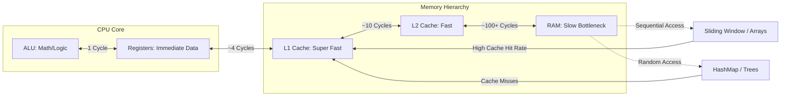
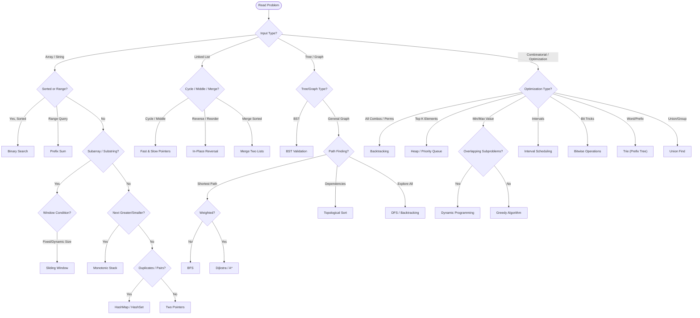

# Brain Muscle: Algorithmic Patterns Landscape (Enhanced)
**With Python Implementations & LeetCode Problem Matching**

---

## 💻 The Hardware Reality: Why These Patterns Work

Algorithms are strategies to optimize how we feed data from **RAM** to the **CPU**. The goal is to minimize **Latency** (waiting for data) and maximize **Throughput** (doing work).



| Algo Pattern | Hardware/OS Concept | Why it's fast |
| :--- | :--- | :--- |
| **Arrays / Sliding Window** | **Spatial Locality** | CPU Cache pre-fetches neighbors. Sequential access is king. |
| **DP (Tabulation)** | **Spatial Locality + Reuse** | Sequential writes to an array; never re-compute (saves CPU cycles). |
| **Recursion / DFS** | **Stack Memory** | Uses the Call Stack (LIFO). Can be slow due to context switching/overhead. |
| **HashMap** | **Random Access (RAM)** | Trades memory space to avoid CPU scanning cycles (O(1) vs O(N)). |
| **Bitwise** | **ALU (Arithmetic Logic Unit)** | Uses the simplest, fastest CPU circuits (AND, OR, XOR). |

---

## 🧠 The Mindset Diagram (ENHANCED)



---

## 🧠 The Mindset: Trigger -> Template

When reading a problem, look for keywords (**Triggers**) to identify the underlying pattern.

---

# 1. ARRAYS & STRINGS (Linear Data Structures)

## 1.1 Sliding Window

**Triggers:** "Longest/Shortest substring", "Subarray of size K", "Continuous", "At most K", "Contain all"

**Template:**
```python
def slidingWindow(s: str, target: str) -> str:
    from collections import defaultdict
    
    if len(target) > len(s):
        return ""
    
    window = defaultdict(int)
    required = defaultdict(int)
    for char in target:
        required[char] += 1
    
    formed = 0  # Number of unique chars in window with desired frequency
    left = 0
    result = float("inf"), None, None  # (window length, left, right)
    
    for right in range(len(s)):
        char = s[right]
        window[char] += 1
        
        if char in required and window[char] == required[char]:
            formed += 1
        
        # Try to contract window
        while left <= right and formed == len(required):
            char = s[left]
            
            # Update result if this window is smaller
            if right - left + 1 < result[0]:
                result = (right - left + 1, left, right)
            
            # Remove character from left
            window[char] -= 1
            if char in required and window[char] < required[char]:
                formed -= 1
            
            left += 1
    
    return "" if result[0] == float("inf") else s[result[1]:result[2] + 1]
```

**Top LeetCode Problems:**
- ✅ **LC 3** - Longest Substring Without Repeating Characters (Medium)
- ✅ **LC 76** - Minimum Window Substring (Hard)
- ✅ **LC 438** - Find All Anagrams in a String (Medium)
- ✅ **LC 567** - Permutation in String (Medium)
- ✅ **LC 1004** - Max Consecutive Ones III (Medium)

---

## 1.2 Two Pointers

**Triggers:** "Sorted array", "Pair sum", "Remove duplicates", "In-place", "Reverse"

**Template:**
```python
def twoSum(nums: List[int], target: int) -> List[int]:
    """Find two numbers that sum to target in SORTED array"""
    left, right = 0, len(nums) - 1
    
    while left < right:
        total = nums[left] + nums[right]
        
        if total == target:
            return [left, right]
        elif total < target:
            left += 1
        else:
            right -= 1
    
    return []

def removeDuplicates(nums: List[int]) -> int:
    """Remove duplicates in-place"""
    if len(nums) == 0:
        return 0
    
    left = 0
    for right in range(1, len(nums)):
        if nums[right] != nums[left]:
            left += 1
            nums[left] = nums[right]
    
    return left + 1
```

**Top LeetCode Problems:**
- ✅ **LC 1** - Two Sum (sorted version) (Easy)
- ✅ **LC 26** - Remove Duplicates from Sorted Array (Easy)
- ✅ **LC 167** - Two Sum II (Easy)
- ✅ **LC 125** - Valid Palindrome (Easy)
- ✅ **LC 15** - 3Sum (Medium)

---

## 1.3 Prefix Sum

**Triggers:** "Sum of subarray", "Range sum query", "Cumulative sum", "Continuous sum"

**Template:**
```python
class PrefixSum:
    def __init__(self, nums: List[int]):
        """Build prefix sum array"""
        self.prefix = [0]
        for num in nums:
            self.prefix.append(self.prefix[-1] + num)
    
    def rangeSum(self, left: int, right: int) -> int:
        """Get sum of nums[left:right+1]"""
        return self.prefix[right + 1] - self.prefix[left]

def subarraySum(nums: List[int], k: int) -> int:
    """Count subarrays with sum == k"""
    count = 0
    sum_freq = {0: 1}  # prefix_sum -> frequency
    current_sum = 0
    
    for num in nums:
        current_sum += num
        # Check if (current_sum - k) exists
        if current_sum - k in sum_freq:
            count += sum_freq[current_sum - k]
        sum_freq[current_sum] = sum_freq.get(current_sum, 0) + 1
    
    return count
```

**Top LeetCode Problems:**
- ✅ **LC 303** - Range Sum Query - Immutable (Easy)
- ✅ **LC 560** - Subarray Sum Equals K (Medium)
- ✅ **LC 1248** - Count Number of Nice Subarrays (Medium)
- ✅ **LC 1732** - Find the Highest Altitude (Easy)
- ✅ **LC 238** - Product of Array Except Self (Medium)

---

## 1.4 Monotonic Stack

**Triggers:** "Next greater element", "Next smaller element", "Daily temperatures", "Trap rain water"

**Template:**
```python
def nextGreaterElement(nums: List[int]) -> List[int]:
    """For each element, find the next greater element"""
    result = [-1] * len(nums)
    stack = []  # Indices of decreasing elements
    
    for i in range(len(nums)):
        # Pop stack while current element is greater
        while stack and nums[i] > nums[stack[-1]]:
            prev_idx = stack.pop()
            result[prev_idx] = nums[i]
        
        stack.append(i)
    
    return result

def trap(height: List[int]) -> int:
    """Trap rain water using monotonic stack"""
    if not height:
        return 0
    
    stack = []
    water = 0
    
    for i in range(len(height)):
        while stack and height[i] > height[stack[-1]]:
            top = stack.pop()
            if not stack:
                break
            
            h = min(height[stack[-1]], height[i]) - height[top]
            width = i - stack[-1] - 1
            water += h * width
        
        stack.append(i)
    
    return water
```

**Top LeetCode Problems:**
- ✅ **LC 496** - Next Greater Element I (Easy)
- ✅ **LC 503** - Next Greater Element II (Medium)
- ✅ **LC 739** - Daily Temperatures (Medium)
- ✅ **LC 42** - Trapping Rain Water (Hard)
- ✅ **LC 901** - Online Stock Span (Medium)

---

## 1.5 Binary Search

**Triggers:** "Sorted array", "Search in O(log n)", "Find first/last position", "Rotated sorted array"

**Template:**
```python
def binarySearch(nums: List[int], target: int) -> int:
    """Find target in sorted array"""
    left, right = 0, len(nums) - 1
    
    while left <= right:
        mid = (left + right) // 2
        
        if nums[mid] == target:
            return mid
        elif nums[mid] < target:
            left = mid + 1
        else:
            right = mid - 1
    
    return -1

def searchRange(nums: List[int], target: int) -> List[int]:
    """Find first and last position of target"""
    def findFirst(nums, target):
        left, right = 0, len(nums) - 1
        result = -1
        while left <= right:
            mid = (left + right) // 2
            if nums[mid] == target:
                result = mid
                right = mid - 1  # Continue searching left
            elif nums[mid] < target:
                left = mid + 1
            else:
                right = mid - 1
        return result
    
    def findLast(nums, target):
        left, right = 0, len(nums) - 1
        result = -1
        while left <= right:
            mid = (left + right) // 2
            if nums[mid] == target:
                result = mid
                left = mid + 1  # Continue searching right
            elif nums[mid] < target:
                left = mid + 1
            else:
                right = mid - 1
        return result
    
    return [findFirst(nums, target), findLast(nums, target)]

def searchInRotatedArray(nums: List[int], target: int) -> int:
    """Search in rotated sorted array"""
    left, right = 0, len(nums) - 1
    
    while left <= right:
        mid = (left + right) // 2
        
        if nums[mid] == target:
            return mid
        
        # Determine which side is sorted
        if nums[left] <= nums[mid]:
            # Left side is sorted
            if nums[left] <= target < nums[mid]:
                right = mid - 1
            else:
                left = mid + 1
        else:
            # Right side is sorted
            if nums[mid] < target <= nums[right]:
                left = mid + 1
            else:
                right = mid - 1
    
    return -1
```

**Top LeetCode Problems:**
- ✅ **LC 704** - Binary Search (Easy)
- ✅ **LC 34** - Find First and Last Position (Medium)
- ✅ **LC 33** - Search in Rotated Sorted Array (Medium)
- ✅ **LC 153** - Find Minimum in Rotated Sorted Array (Medium)
- ✅ **LC 162** - Find Peak Element (Medium)

---

# 2. LINKED LISTS

## 2.1 Fast & Slow Pointers

**Triggers:** "Cycle detection", "Middle of list", "Palindrome check", "Intersection"

**Template:**
```python
class ListNode:
    def __init__(self, val=0, next=None):
        self.val = val
        self.next = next

def detectCycle(head: ListNode) -> ListNode:
    """Detect cycle and return node where cycle begins"""
    if not head or not head.next:
        return None
    
    slow = fast = head
    
    # Find if cycle exists
    while fast and fast.next:
        slow = slow.next
        fast = fast.next.next
        if slow == fast:
            break
    else:
        return None
    
    # Find cycle start
    ptr1 = head
    ptr2 = slow
    while ptr1 != ptr2:
        ptr1 = ptr1.next
        ptr2 = ptr2.next
    
    return ptr1

def middleOfList(head: ListNode) -> ListNode:
    """Find middle of linked list"""
    slow = fast = head
    
    while fast and fast.next:
        slow = slow.next
        fast = fast.next.next
    
    return slow
```

**Top LeetCode Problems:**
- ✅ **LC 141** - Linked List Cycle (Easy)
- ✅ **LC 142** - Linked List Cycle II (Medium)
- ✅ **LC 876** - Middle of the Linked List (Easy)
- ✅ **LC 234** - Palindrome Linked List (Easy)
- ✅ **LC 287** - Find the Duplicate Number (Medium)

---

## 2.2 In-Place Reversal

**Triggers:** "Reverse linked list", "Reverse nodes in k-group", "Reorder list"

**Template:**
```python
def reverseList(head: ListNode) -> ListNode:
    """Reverse entire linked list"""
    prev = None
    curr = head
    
    while curr:
        next_temp = curr.next
        curr.next = prev
        prev = curr
        curr = next_temp
    
    return prev

def reverseKGroup(head: ListNode, k: int) -> ListNode:
    """Reverse every k group of nodes"""
    def reverseGroup(head, k):
        """Reverse k nodes and return new head"""
        curr = head
        prev = None
        
        for _ in range(k):
            if not curr:
                return head
            next_temp = curr.next
            curr.next = prev
            prev = curr
            curr = next_temp
        
        return prev, curr
    
    # Check if there are k nodes
    curr = head
    for _ in range(k):
        if not curr:
            return head
        curr = curr.next
    
    new_head, next_group = reverseGroup(head, k)
    head.next = reverseKGroup(next_group, k)
    
    return new_head
```

**Top LeetCode Problems:**
- ✅ **LC 206** - Reverse Linked List (Easy)
- ✅ **LC 92** - Reverse Linked List II (Medium)
- ✅ **LC 25** - Reverse Nodes in k-Group (Hard)
- ✅ **LC 143** - Reorder List (Medium)

---

# 3. TREES & GRAPHS

## 3.1 BFS (Breadth-First Search)

**Triggers:** "Shortest path (unweighted)", "Level order", "Nearest neighbor", "Connected component"

**Template:**
```python
from collections import deque

def levelOrder(root: TreeNode) -> List[List[int]]:
    """Level order traversal of binary tree"""
    if not root:
        return []
    
    result = []
    queue = deque([root])
    
    while queue:
        level_size = len(queue)
        level_values = []
        
        for _ in range(level_size):
            node = queue.popleft()
            level_values.append(node.val)
            
            if node.left:
                queue.append(node.left)
            if node.right:
                queue.append(node.right)
        
        result.append(level_values)
    
    return result

def shortestPathBFS(graph: Dict, start, end) -> int:
    """Find shortest path in unweighted graph"""
    if start == end:
        return 0
    
    visited = {start}
    queue = deque([(start, 0)])
    
    while queue:
        node, dist = queue.popleft()
        
        for neighbor in graph[node]:
            if neighbor == end:
                return dist + 1
            
            if neighbor not in visited:
                visited.add(neighbor)
                queue.append((neighbor, dist + 1))
    
    return -1
```

**Top LeetCode Problems:**
- ✅ **LC 102** - Binary Tree Level Order Traversal (Medium)
- ✅ **LC 103** - Binary Tree Zigzag Level Order (Medium)
- ✅ **LC 127** - Word Ladder (Hard)
- ✅ **LC 752** - Open the Lock (Medium)
- ✅ **LC 1091** - Shortest Path in Binary Matrix (Medium)

---

## 3.2 DFS (Depth-First Search)

**Triggers:** "Path existence", "Tree depth", "Connected components", "All paths"

**Template:**
```python
def dfs_recursive(node, visited):
    """DFS using recursion"""
    visited.add(node)
    
    for neighbor in graph[node]:
        if neighbor not in visited:
            dfs_recursive(neighbor, visited)

def dfs_iterative(start, graph):
    """DFS using stack"""
    visited = set()
    stack = [start]
    
    while stack:
        node = stack.pop()
        if node not in visited:
            visited.add(node)
            stack.extend(reversed(graph[node]))
    
    return visited

def allPathsSourceTarget(graph: List[List[int]]) -> List[List[int]]:
    """Find all paths from node 0 to node n-1"""
    result = []
    path = [0]
    
    def dfs(node):
        if node == len(graph) - 1:
            result.append(path[:])
            return
        
        for neighbor in graph[node]:
            path.append(neighbor)
            dfs(neighbor)
            path.pop()
    
    dfs(0)
    return result
```

**Top LeetCode Problems:**
- ✅ **LC 200** - Number of Islands (Medium)
- ✅ **LC 130** - Surrounded Regions (Medium)
- ✅ **LC 112** - Path Sum (Easy)
- ✅ **LC 113** - Path Sum II (Medium)
- ✅ **LC 797** - All Paths From Source to Target (Medium)

---

## 3.3 Topological Sort

**Triggers:** "Course schedule", "Dependencies", "Order of tasks", "Directed acyclic graph"

**Template:**
```python
def topologicalSort(numCourses: int, prerequisites: List[List[int]]) -> List[int]:
    """Kahn's Algorithm for topological sort"""
    from collections import deque, defaultdict
    
    # Build graph and in-degree
    graph = defaultdict(list)
    in_degree = [0] * numCourses
    
    for course, prereq in prerequisites:
        graph[prereq].append(course)
        in_degree[course] += 1
    
    # Add all nodes with 0 in-degree to queue
    queue = deque([i for i in range(numCourses) if in_degree[i] == 0])
    result = []
    
    while queue:
        node = queue.popleft()
        result.append(node)
        
        for neighbor in graph[node]:
            in_degree[neighbor] -= 1
            if in_degree[neighbor] == 0:
                queue.append(neighbor)
    
    return result if len(result) == numCourses else []
```

**Top LeetCode Problems:**
- ✅ **LC 207** - Course Schedule (Medium)
- ✅ **LC 210** - Course Schedule II (Medium)
- ✅ **LC 269** - Alien Dictionary (Hard)
- ✅ **LC 310** - Minimum Height Trees (Medium)

---

## 3.4 Union Find (Disjoint Set Union)

**Triggers:** "Connectivity", "Group elements", "Detect cycle (undirected)", "Minimum spanning tree"

**Template:**
```python
class UnionFind:
    def __init__(self, n):
        self.parent = list(range(n))
        self.rank = [0] * n
    
    def find(self, x):
        """Find root with path compression"""
        if self.parent[x] != x:
            self.parent[x] = self.find(self.parent[x])
        return self.parent[x]
    
    def union(self, x, y):
        """Union by rank"""
        root_x = self.find(x)
        root_y = self.find(y)
        
        if root_x == root_y:
            return False
        
        # Union by rank
        if self.rank[root_x] < self.rank[root_y]:
            self.parent[root_x] = root_y
        elif self.rank[root_x] > self.rank[root_y]:
            self.parent[root_y] = root_x
        else:
            self.parent[root_y] = root_x
            self.rank[root_x] += 1
        
        return True
    
    def connected(self, x, y):
        """Check if x and y are connected"""
        return self.find(x) == self.find(y)
```

**Top LeetCode Problems:**
- ✅ **LC 323** - Number of Connected Components (Medium)
- ✅ **LC 261** - Graph Valid Tree (Medium)
- ✅ **LC 990** - Satisfiability of Equality Equations (Medium)
- ✅ **LC 1202** - Smallest String With Swaps (Medium)

---

## 3.5 Trie (Prefix Tree)

**Triggers:** "Autocomplete", "Word search", "Prefix matching", "Dictionary"

**Template:**
```python
class TrieNode:
    def __init__(self):
        self.children = {}
        self.isEndOfWord = False

class Trie:
    def __init__(self):
        self.root = TrieNode()
    
    def insert(self, word: str):
        node = self.root
        for char in word:
            if char not in node.children:
                node.children[char] = TrieNode()
            node = node.children[char]
        node.isEndOfWord = True
    
    def search(self, word: str) -> bool:
        node = self.root
        for char in word:
            if char not in node.children:
                return False
            node = node.children[char]
        return node.isEndOfWord
    
    def startsWith(self, prefix: str) -> bool:
        node = self.root
        for char in prefix:
            if char not in node.children:
                return False
            node = node.children[char]
        return True
```

**Top LeetCode Problems:**
- ✅ **LC 208** - Implement Trie (Medium)
- ✅ **LC 211** - Design Add and Search Words Data Structure (Medium)
- ✅ **LC 212** - Word Search II (Hard)
- ✅ **LC 648** - Replace Words (Medium)

---

# 4. DYNAMIC PROGRAMMING

## 4.1 1D DP

**Triggers:** "Climbing stairs", "House robber", "Maximum subarray sum", "Longest increasing subsequence"

**Template:**
```python
def climbStairs(n: int) -> int:
    """DP: How many ways to climb n stairs (1 or 2 steps)"""
    if n <= 1:
        return n
    
    dp = [0] * (n + 1)
    dp[1] = 1
    dp[2] = 2
    
    for i in range(3, n + 1):
        dp[i] = dp[i - 1] + dp[i - 2]
    
    return dp[n]

def rob(nums: List[int]) -> int:
    """House robber: max money without robbing adjacent houses"""
    if not nums:
        return 0
    if len(nums) == 1:
        return nums[0]
    
    dp = [0] * len(nums)
    dp[0] = nums[0]
    dp[1] = max(nums[0], nums[1])
    
    for i in range(2, len(nums)):
        dp[i] = max(dp[i - 1], dp[i - 2] + nums[i])
    
    return dp[-1]
```

**Top LeetCode Problems:**
- ✅ **LC 70** - Climbing Stairs (Easy)
- ✅ **LC 198** - House Robber (Easy)
- ✅ **LC 213** - House Robber II (Medium)
- ✅ **LC 300** - Longest Increasing Subsequence (Medium)
- ✅ **LC 55** - Jump Game (Medium)

---

## 4.2 0/1 Knapsack

**Triggers:** "Select items with weight/value", "Subset sum", "Equal partition"

**Template:**
```python
def knapsack(weights: List[int], values: List[int], capacity: int) -> int:
    """0/1 Knapsack: select items to maximize value within capacity"""
    n = len(weights)
    dp = [[0] * (capacity + 1) for _ in range(n + 1)]
    
    for i in range(1, n + 1):
        for w in range(capacity + 1):
            if weights[i - 1] <= w:
                # Either take item or not
                dp[i][w] = max(
                    values[i - 1] + dp[i - 1][w - weights[i - 1]],  # Take
                    dp[i - 1][w]  # Don't take
                )
            else:
                dp[i][w] = dp[i - 1][w]  # Can't take
    
    return dp[n][capacity]

def canPartition(nums: List[int]) -> bool:
    """Subset sum: can partition into two equal sum subsets"""
    total = sum(nums)
    if total % 2 != 0:
        return False
    
    target = total // 2
    dp = [False] * (target + 1)
    dp[0] = True
    
    for num in nums:
        for i in range(target, num - 1, -1):
            dp[i] = dp[i] or dp[i - num]
    
    return dp[target]
```

**Top LeetCode Problems:**
- ✅ **LC 416** - Partition Equal Subset Sum (Medium)
- ✅ **LC 494** - Target Sum (Medium)
- ✅ **LC 1049** - Last Stone Weight II (Medium)

---

## 4.3 Unbounded Knapsack

**Triggers:** "Coin change", "Rod cutting", "Reuse items allowed"

**Template:**
```python
def coinChange(coins: List[int], amount: int) -> int:
    """Unbounded knapsack: minimum coins to make amount"""
    dp = [float('inf')] * (amount + 1)
    dp[0] = 0
    
    for coin in coins:
        for i in range(coin, amount + 1):
            dp[i] = min(dp[i], dp[i - coin] + 1)
    
    return dp[amount] if dp[amount] != float('inf') else -1
```

**Top LeetCode Problems:**
- ✅ **LC 322** - Coin Change (Medium)
- ✅ **LC 518** - Coin Change 2 (Medium)
- ✅ **LC 377** - Combination Sum IV (Medium)

---

## 4.4 2D DP (Strings)

**Triggers:** "Edit distance", "Longest common subsequence", "Pattern matching"

**Template:**
```python
def editDistance(word1: str, word2: str) -> int:
    """Edit distance (Levenshtein distance)"""
    m, n = len(word1), len(word2)
    dp = [[0] * (n + 1) for _ in range(m + 1)]
    
    # Base cases
    for i in range(m + 1):
        dp[i][0] = i
    for j in range(n + 1):
        dp[0][j] = j
    
    for i in range(1, m + 1):
        for j in range(1, n + 1):
            if word1[i - 1] == word2[j - 1]:
                dp[i][j] = dp[i - 1][j - 1]
            else:
                dp[i][j] = 1 + min(
                    dp[i - 1][j],      # Delete
                    dp[i][j - 1],      # Insert
                    dp[i - 1][j - 1]   # Replace
                )
    
    return dp[m][n]
```

**Top LeetCode Problems:**
- ✅ **LC 72** - Edit Distance (Hard)
- ✅ **LC 1143** - Longest Common Subsequence (Medium)
- ✅ **LC 1092** - Shortest Common Supersequence (Hard)

---

# 5. BACKTRACKING

## 5.1 Backtracking

**Triggers:** "All permutations", "All subsets", "Combinations", "N-Queens", "Sudoku"

**Template:**
```python
def permute(nums: List[int]) -> List[List[int]]:
    """Generate all permutations"""
    result = []
    
    def backtrack(path, remaining):
        if not remaining:
            result.append(path[:])
            return
        
        for i in range(len(remaining)):
            # Choose
            path.append(remaining[i])
            # Explore
            backtrack(path, remaining[:i] + remaining[i+1:])
            # Unchoose
            path.pop()
    
    backtrack([], nums)
    return result

def subsets(nums: List[int]) -> List[List[int]]:
    """Generate all subsets"""
    result = []
    
    def backtrack(start, path):
        result.append(path[:])
        
        for i in range(start, len(nums)):
            path.append(nums[i])
            backtrack(i + 1, path)
            path.pop()
    
    backtrack(0, [])
    return result

def combination(n: int, k: int) -> List[List[int]]:
    """Generate all combinations of k numbers from 1 to n"""
    result = []
    
    def backtrack(start, path):
        if len(path) == k:
            result.append(path[:])
            return
        
        for i in range(start, n + 1):
            path.append(i)
            backtrack(i + 1, path)
            path.pop()
    
    backtrack(1, [])
    return result
```

**Top LeetCode Problems:**
- ✅ **LC 46** - Permutations (Medium)
- ✅ **LC 78** - Subsets (Medium)
- ✅ **LC 77** - Combinations (Medium)
- ✅ **LC 51** - N-Queens (Hard)
- ✅ **LC 37** - Sudoku Solver (Hard)

---

# 6. HEAP / PRIORITY QUEUE

## 6.1 Heap (Priority Queue)

**Triggers:** "Top K elements", "Kth smallest/largest", "Median of stream", "Meeting rooms"

**Template:**
```python
import heapq

def topKFrequent(nums: List[int], k: int) -> List[int]:
    """Top K frequent elements using min-heap"""
    from collections import Counter
    count = Counter(nums)
    
    # Min-heap of size k
    heap = []
    for num, freq in count.items():
        if len(heap) < k:
            heapq.heappush(heap, (freq, num))
        elif freq > heap[0][0]:
            heapq.heapreplace(heap, (freq, num))
    
    return [num for freq, num in heap]

def findMedianSortedArrays(nums1: List[int], nums2: List[int]) -> float:
    """Find median of two sorted arrays"""
    combined = sorted(nums1 + nums2)
    n = len(combined)
    
    if n % 2 == 1:
        return combined[n // 2]
    else:
        return (combined[n // 2 - 1] + combined[n // 2]) / 2

class MedianFinder:
    """Median of Data Stream using two heaps"""
    def __init__(self):
        self.small = []  # Max-heap (negate values)
        self.large = []  # Min-heap
    
    def addNum(self, num: int):
        if not self.small or num <= -self.small[0]:
            heapq.heappush(self.small, -num)
        else:
            heapq.heappush(self.large, num)
        
        # Balance heaps
        if len(self.small) > len(self.large) + 1:
            val = -heapq.heappop(self.small)
            heapq.heappush(self.large, val)
        elif len(self.large) > len(self.small):
            val = heapq.heappop(self.large)
            heapq.heappush(self.small, -val)
    
    def findMedian(self) -> float:
        if len(self.small) > len(self.large):
            return -self.small[0]
        return (-self.small[0] + self.large[0]) / 2
```

**Top LeetCode Problems:**
- ✅ **LC 347** - Top K Frequent Elements (Medium)
- ✅ **LC 215** - Kth Largest Element (Medium)
- ✅ **LC 295** - Find Median from Data Stream (Hard)
- ✅ **LC 253** - Meeting Rooms II (Medium)
- ✅ **LC 1046** - Last Stone (Easy)

---

# 7. GREEDY & INTERVAL

## 7.1 Interval Scheduling

**Triggers:** "Merge intervals", "Meeting rooms", "Interval scheduling"

**Template:**
```python
def mergeIntervals(intervals: List[List[int]]) -> List[List[int]]:
    """Merge overlapping intervals"""
    if not intervals:
        return []
    
    intervals.sort()
    result = [intervals[0]]
    
    for start, end in intervals[1:]:
        if start <= result[-1][1]:
            result[-1][1] = max(result[-1][1], end)
        else:
            result.append([start, end])
    
    return result
```

**Top LeetCode Problems:**
- ✅ **LC 56** - Merge Intervals (Medium)
- ✅ **LC 452** - Minimum Number of Arrows (Medium)
- ✅ **LC 435** - Non-overlapping Intervals (Medium)

---

# 8. BITWISE OPERATIONS

## 8.1 Bitwise

**Triggers:** "Single number", "Power of two", "Bit manipulation", "XOR", "AND", "OR"

**Template:**
```python
def singleNumber(nums: List[int]) -> int:
    """Find single number appearing once (others appear twice) using XOR"""
    result = 0
    for num in nums:
        result ^= num
    return result

def isPowerOfTwo(n: int) -> bool:
    """Check if n is power of two"""
    return n > 0 and (n & (n - 1)) == 0

def countBits(n: int) -> List[int]:
    """Count 1-bits in all numbers from 0 to n"""
    result = [0] * (n + 1)
    for i in range(1, n + 1):
        result[i] = result[i // 2] + (i % 2)
    return result
```

**Top LeetCode Problems:**
- ✅ **LC 136** - Single Number (Easy)
- ✅ **LC 231** - Power of Two (Easy)
- ✅ **LC 338** - Counting Bits (Easy)
- ✅ **LC 191** - Number of 1 Bits (Easy)

---

## 🎯 **Quick Reference: When to Use Each Pattern**

| Problem Type | Pattern | Time | Space |
|---|---|---|---|
| Longest/Shortest substring | Sliding Window | O(n) | O(k) |
| Sorted array operations | Two Pointers / Binary Search | O(n) or O(log n) | O(1) |
| Subarray sum queries | Prefix Sum | O(n) setup, O(1) query | O(n) |
| Next greater element | Monotonic Stack | O(n) | O(n) |
| Cycle detection (list) | Fast & Slow Pointers | O(n) | O(1) |
| Shortest path (unweighted) | BFS | O(V + E) | O(V) |
| Connectivity | Union Find | O(α(n)) amortized | O(n) |
| Top K elements | Heap | O(n log k) | O(k) |
| All subsets/combinations | Backtracking | O(2^n) or O(n!) | O(n) |
| Optimal substructure | DP | Varies | Varies |

---

## 📝 **30-Second Reaction Checklist**

1. ✅ What is the input type? (Array, string, tree, graph, etc.)
2. ✅ Is the data sorted?
3. ✅ Is it asking for subarray / substring / path?
4. ✅ Is it asking for shortest / longest / first / last?
5. ✅ Is there dependency or cycle detection?
6. ✅ Are we looking for all combinations or top K?
7. ✅ Can we use a hash map / set for O(1) lookup?
8. ✅ Does this have overlapping subproblems (DP)?

---

**Good luck with your interviews, Mason! 🚀**
