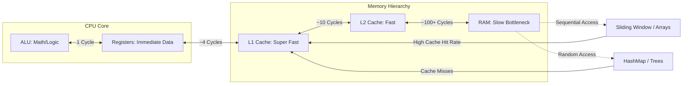
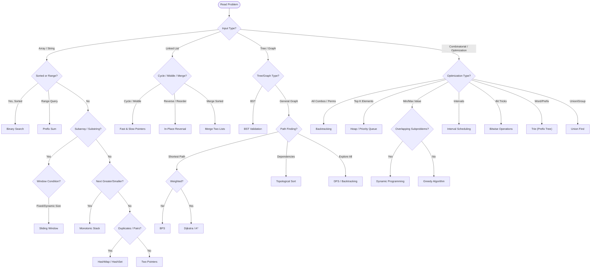

# Brain Muscle: Algorithmic Patterns Landscape (Enhanced)
**With Python Implementations & LeetCode Problem Matching**

---

## 💻 The Hardware Reality: Why These Patterns Work

Algorithms are strategies to optimize how we feed data from **RAM** to the **CPU**. The goal is to minimize **Latency** (waiting for data) and maximize **Throughput** (doing work).

| Algo Pattern | Hardware/OS Concept | Why it's fast |
| :--- | :--- | :--- |
| **Arrays / Sliding Window** | **Spatial Locality** | CPU Cache pre-fetches neighbors. Sequential access is king. |
| **DP (Tabulation)** | **Spatial Locality + Reuse** | Sequential writes to an array; never re-compute (saves CPU cycles). |
| **Recursion / DFS** | **Stack Memory** | Uses the Call Stack (LIFO). Can be slow due to context switching/overhead. |
| **HashMap** | **Random Access (RAM)** | Trades memory space to avoid CPU scanning cycles (O(1) vs O(N)). |
| **Bitwise** | **ALU (Arithmetic Logic Unit)** | Uses the simplest, fastest CPU circuits (AND, OR, XOR). |

---

## 🧠 The Mindset Diagram (ENHANCED)

---

## 🧠 The Mindset: Trigger -> Template

When reading a problem, look for keywords (**Triggers**) to identify the underlying pattern.
